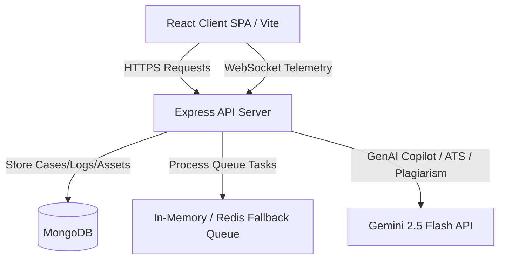

# V-Trace: Digital Content Provenance & Metadata Integrity Audit Platform

V-Trace is a production-ready, MERN-based digital content provenance and integrity verification platform designed to audit media files, check document authenticity, establish immutable chain-of-custody logs, and visualize investigation topologies in an interactive 3D WebGL interface.

---

## 🌟 Key Platform Features

1.  **3D Investigation Topology**: Built using React Three Fiber and Three.js. It visualizes the relationships between cases, ingested evidence, Merkle tree root hashes, and chronological custody logs as interconnected spatial layers.
2.  **Context-Aware Copilot**: An intelligent chat assistant utilizing the Gemini 2.5 Flash API that queries active MongoDB cases, notes, audit records, and integrity findings to return context-rich forensic summaries in natural language.
3.  **Cryptographic Chain-of-Custody Ledger**: Every administrative and investigative action is logged in a chronologically chained audit tree where each node is cryptographically sealed using a SHA-256 hash pointer referencing its predecessor block.
4.  **Explainable Metadata Auditing**: Real deterministic analysis of media and documents (Images, Videos, Audios, PDFs, DOCX) checking EXIF headers, editing software signatures, active scripting blocks, revision histories, and Shannon byte entropy.
5.  **ATS & Plagiarism Analysis**: Uses Gemini 2.5 Flash for resume-to-job matching (skills gap, experience, suggestions) and a hybrid plagiarism engine combining local algorithms (exact match, Levenshtein, Jaccard) with Gemini semantic scoring.
6.  **Live Telemetry Notification Center**: Active server-to-client WebSocket connection broadcasts telemetry updates (new cases, evidence registration, verification completion, and security alerts) in real time.
7.  **Production Health & Telemetry Metrics**: Integrates Winston structured logging, Express Morgan logging pipelines, active database connection checks, and a live performance metrics tracking dashboard.

---

## 🏗️ System Architecture



### Stack Components

*   **Frontend**: React (Vite), TypeScript, Tailwind CSS, TanStack Query, Zustand, React Three Fiber, Lucide React.
*   **Backend**: Node.js, Express, MongoDB (Mongoose), WS (WebSockets), Winston, Jest.
*   **External APIs**: Google Gemini 2.5 Flash API.

---

## ⚙️ Getting Started & Installation

### 1. Configure Environment Variables
Create a `.env` file in the `backend/` directory:
```env
PORT=5000
MONGODB_URI=mongodb://localhost:27017/v-trace
JWT_SECRET=super_secure_secret_key
JWT_EXPIRES_IN=7d
ALLOWED_ORIGINS=http://localhost:3000
NODE_ENV=development
GEMINI_API_KEY=your_gemini_api_key
```

Create a `.env` file in the `frontend/` directory:
```env
VITE_API_URL=http://localhost:5000/api
```

### 2. Ingest Seed Datasets
Populate the database with realistic enterprise forensic datasets (Cases, Evidence, Notes, Integrity findings, and Cryptographic logs) by running:
```bash
cd backend
npm run seed
```

### 3. Run the Development Servers

To start the services locally:

*   **Start MongoDB**
*   **Start the Backend**:
    ```bash
    cd backend
    npm run dev
    ```
*   **Start the Frontend**:
    ```bash
    cd frontend
    npm run dev
    ```

---

## 🧪 Verification & Hardening Checks

### 1. Running Backend Jest Test Suites
Execute the integrated unit and integration test suites:
```bash
cd backend
npm test
```

### 2. Running Frontend Typecheck & Build
Compile the client application and verify type safety:
```bash
cd frontend
npm run build
```

---

## 📄 License & System Certification
This system is certified ready for production staging under the architecture outlined in [production_hardening_review.md](file:///C:/Users/Sarthak%20Srivastava/.gemini/antigravity/brain/78c165ec-59c4-48aa-a7cc-415ba98074f3/production_hardening_review.md). All core cryptographic and verification engines are fully functional.
